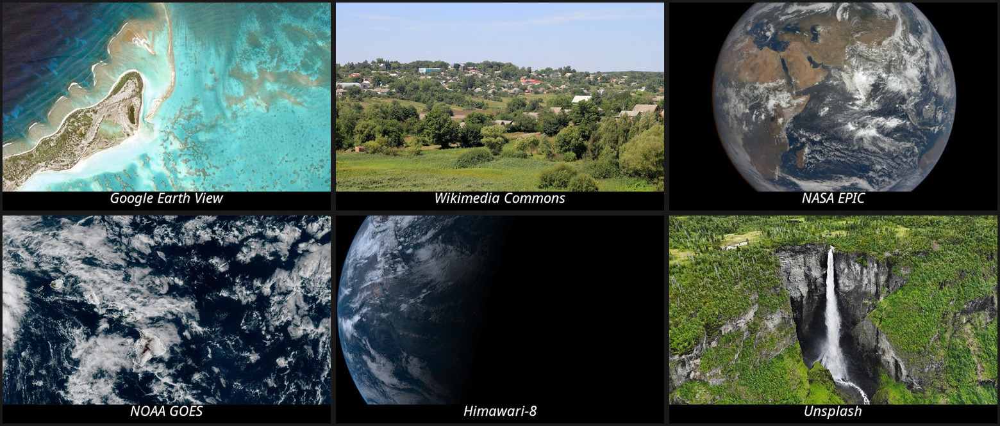
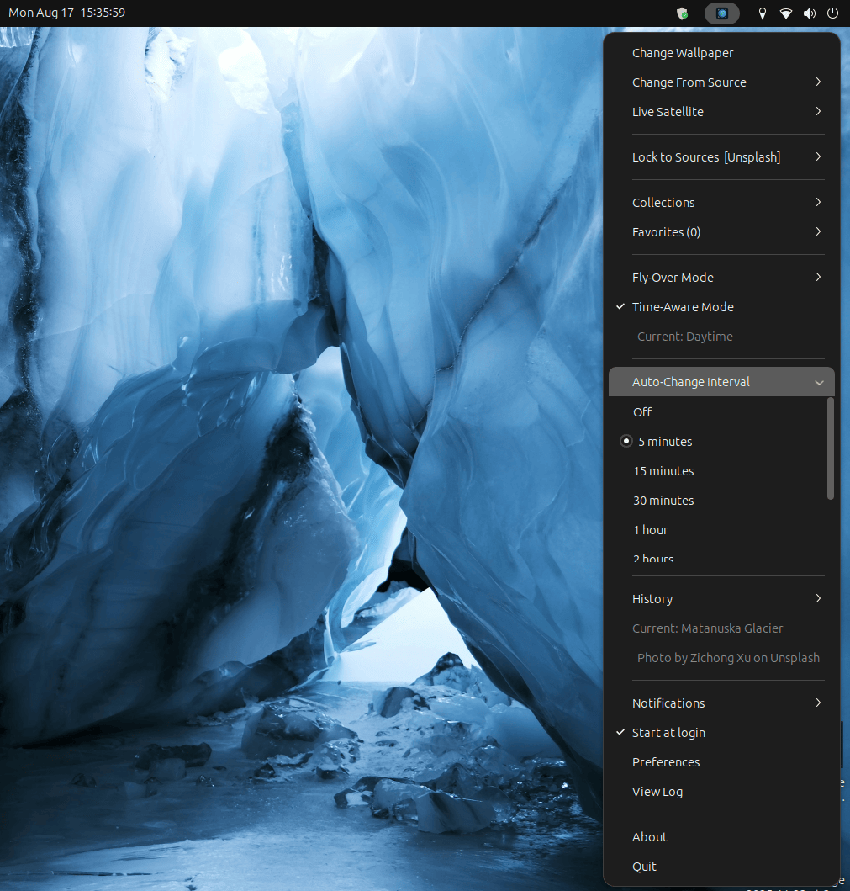

# Earth View Wallpaper Engine

A multi-source desktop wallpaper changer that pulls imagery from weather
satellites, space telescopes, and curated photography archives.

This started life as a small Google Earth View wallpaper script. It set a random
satellite photo from a single list and did nothing else. It has since grown into
a plugin-based engine spanning seven providers, live satellite feeds, source
locking, scenic fly-over routes and time-aware selection, so it now lives here
as its own project. The original is archived at
[AlperSakarya/earthview](https://github.com/AlperSakarya/earthview), where you
can see where it came from. See [Project history](#project-history) for how it
got here.



*Actual output, one image from each of six sources: Google Earth View,
Wikimedia Commons, NASA EPIC, NOAA GOES, Himawari-8 and Unsplash.*



*The tray menu: source selection and locking, live satellite feeds,
collections, fly-over and time-aware modes, the auto-change interval, and
history showing the current image with its attribution.*

## Install

Download the latest `.deb` from the
[releases page](https://github.com/AlperSakarya/earthview-wallpaper/releases/latest),
then install it:

```bash
sudo apt install ./earthview-wallpaper_*_all.deb
```

Or fetch and install in one go:

```bash
curl -LO "$(curl -s https://api.github.com/repos/AlperSakarya/earthview-wallpaper/releases/latest \
  | grep browser_download_url | cut -d'"' -f4)"
sudo apt install ./earthview-wallpaper_*_all.deb
```

Use `apt` rather than `dpkg -i` so dependencies are resolved in one step.
The application starts straight after installation and appears in your system
tray. To launch it manually, or after quitting:

```bash
earthview-wallpaper
```

Enable **Start at login** from the tray menu to have it run on boot.

Requires a GNOME-based desktop with system tray support. Tested on Ubuntu
22.04 and 24.04.

## Sources

Every source discovers its images at run time. No image identifiers are stored
in the code.

| Source | Pool | API key |
|---|---|---|
| **Google Earth View** | 1,511 curated satellite landscapes | no |
| **Wikimedia Commons** | ~1,600 peer-reviewed landscape and astronomy photos, 4-6K | no |
| **NASA EPIC** | ~43,000 full-disc Earth images across 3,592 archive dates | no |
| **GOES-19 / GOES-18** | 23 verified sector views of the Americas, refreshed continuously | no |
| **Himawari-8** | Asia-Pacific, a new frame every 10 minutes | no |
| **NASA APOD** | ~10,000 archive days | optional |
| **Unsplash** | full library, ~52,000 in the wallpaper and nature topics alone | **required** |

Six of the seven work with no key at all.

## Features

- **Multi-source wallpaper engine** with plugin architecture
- **Live satellite feeds** - get the latest real-time Earth imagery
- **Time-aware mode** - picks wallpapers matching time of day (sunrise/day/sunset/night)
- **Fly-over mode** - virtual flights along scenic routes (Nile River, Mediterranean, Andes, Silk Road, Pacific Ring of Fire, Great Barrier Reef)
- **Location-aware** - shows satellite imagery near your location
- **Themed collections** - Volcanic Landscapes, River Deltas, Arctic Ice, Desert Abstract, Human Patterns
- **Favorites** - save wallpapers you love and revisit them
- **History** - browse and reuse recent wallpapers
- **Auto-change** - configurable interval from 5 minutes to 24 hours
- **Preferences dialog** - configure sources, API keys, modes, and schedules
- **System tray indicator** with full menu
- **Auto-start** at login

## Building from source

If you would rather run the code directly, or want to develop against it:

```bash
# system dependencies
sudo apt install python3-gi python3-gi-cairo gir1.2-gtk-3.0 \
  gir1.2-ayatanaappindicator3-0.1 gir1.2-notify-0.7 \
  python3-cairo python3-requests

git clone https://github.com/AlperSakarya/earthview-wallpaper.git
cd earthview-wallpaper
python3 wallpaper-changer/indicator.py
```

To build your own package:

```bash
./build-package.sh
```

That stages the source tree into the package layout, normalises ownership to
`root:root` and permissions to Debian policy, compresses the changelog and man
page, verifies every module reached the archive, and passes `lintian` with no
errors or warnings.

## Uninstall

```bash
sudo apt remove earthview-wallpaper
```

Settings in `~/.config/earthview/` and cached images in `~/.cache/earthview/`
are left in place, since packages should not delete files from home
directories. Remove them by hand for a clean slate:

```bash
rm -rf ~/.config/earthview ~/.cache/earthview
```

## Usage

Launch from applications menu or terminal:
```bash
earthview-wallpaper
```

### System Tray Menu

- **Change Wallpaper** - random image from active sources
- **Change From Source** - pick a specific source for one change (ignores the lock)
- **Live Satellite** - get the most recent image from live feeds
- **Lock to Sources** - restrict changes to one or more sources, or randomize
- **Notifications** - turn notifications off, or keep them quiet while the screen is off
- **Collections** - browse themed image sets
- **Favorites** - manage and use saved wallpapers
- **Fly-Over Mode** - enable location or route-based selection
- **Time-Aware Mode** - adapt to time of day
- **Auto-Change Interval** - set timer (5min to 24h)
- **History** - revisit recent wallpapers
- **View Log** - open the log file for troubleshooting
- **Preferences** - full configuration dialog

### Locking to specific sources

Open **Lock to Sources** in the tray menu and tick the sources you want. Only
those are used for automatic and manual changes, and they rotate evenly among
themselves. Tick a single source to use only that one, for example Unsplash.

Sources that cannot run are marked in the menu, for example Unsplash without
an API key. Locking to one of those falls back to the available sources rather
than leaving the wallpaper unchanged.

Choose **All Sources (randomize)**, or untick everything, to go back to using
every source. The same checkboxes appear under Preferences > Sources. The
current lock is shown in the menu label, e.g. `Lock to Sources [Unsplash]`.

**Change From Source** deliberately ignores the lock, since it is a one-off
request for a specific source.

### Configuration

Settings are stored in `~/.config/earthview/`:
- `config.json` - sources, source lock, intervals, notifications, mode settings
- `history.json` - wallpaper change history, last 100
- `favorites.json` - saved favorites
- `recent_urls.json` - deduplication record preventing repeats within 7 days
- `collections/` - user-created collections

The applied wallpaper is cached at `~/.cache/earthview/wallpaper.jpg`, and the
Wikimedia listing at `~/.cache/earthview/wikimedia_files.json`.

Settings added by a newer version are merged into an existing config on
startup, so upgrading does not leave new options missing.

The application rewrites the whole config file when it saves, so stop it
before editing `config.json` by hand or your changes will be overwritten.

### Logging

A rotating log is written to `~/.cache/earthview/earthview.log`, 1 MB per file
with three backups, reachable from **View Log** in the tray menu. It records
which source was chosen, duplicate rejections, download sizes, suppressed
notifications and provider errors.

For more detail:

```bash
earthview-wallpaper --debug
# or
EARTHVIEW_DEBUG=1 earthview-wallpaper
```

### Notifications

Each wallpaper change shows a notification by default. A notification can wake
a monitor that has powered down, which is unwelcome if the machine sits idle,
so two settings are available under **Notifications** in the tray menu and in
Preferences:

- **Show desktop notifications** — turn them off entirely
- **Stay quiet while the screen is off or locked** — on by default; keeps
  notifications from waking a sleeping display while still showing them
  normally when you are at the machine

The menu also reports the current screen state, and any suppressed
notification is written to the log with its reason.

### Image variety

Sources are used in strict rotation, so each one is selected in turn rather
than at random. Every applied image URL is recorded, and no image repeats
within seven days. At a 5-minute interval that means roughly 336 images per
source per week, which every source can supply.

### API Keys

Six of the seven sources need no key. Configure keys under
**Preferences > Sources**; they are saved to `~/.config/earthview/config.json`
and take effect immediately.

**Unsplash — required.** Get a free key at https://unsplash.com/developers.
There is no keyless route: their internal search endpoint refuses non-browser
clients, `source.unsplash.com` is retired, and the documented API rejects
unauthenticated requests. Only the access key is needed; the secret key is for
OAuth flows this application does not use.

**NASA APOD — optional but recommended.** Without a key it falls back to
NASA's shared `DEMO_KEY`, which is limited to roughly 30 requests per hour
across all users, so it is frequently rate limited. A free key from
https://api.nasa.gov removes that.

Keys live outside the repository and are never committed.

#### How Unsplash is queried

Requests go to `GET /photos/random`, which returns genuinely random photos
rather than relevance-ranked search results, and accepts up to 30 per request.
Measured subject accuracy while choosing the approach:

| approach | on subject |
|---|---|
| `query="mountain nature scenery"` | 30/30 |
| `query="landscape"` | 27/30 |
| `topics="wallpapers,nature"` | 12/30 |

The official topics are broad curation buckets, so `wallpapers` also holds 3D
renders, abstracts and animals. Specific queries are used instead.

Each refill draws three queries of 30, merged and shuffled, giving roughly 85
photos per refill. That keeps consecutive wallpapers from all sharing one
theme, and keeps usage far inside the 50 requests per hour a demo key allows.
Results are screened against their descriptions to reject people-centric
photos.

As their API Guidelines require, selecting an image as a wallpaper registers a
request to that photo's `download_location` endpoint, and images are always
served from the hotlinked `urls` they provide.

## Adding Custom Collections

Create a JSON file in `~/.config/earthview/collections/` or
`wallpaper-changer/wallpaper_collections/`:

```json
{
  "id": "my_collection",
  "name": "My Collection",
  "description": "My custom wallpaper set",
  "icon": "",
  "tags": ["custom"],
  "images": [
    {
      "url": "https://example.com/image.jpg",
      "title": "My Image",
      "description": "A description",
      "category": "daytime",
      "tags": ["custom"],
      "attribution": "Credit"
    }
  ]
}
```

## Adding New Sources

Create a Python file in `wallpaper-changer/sources/`:

```python
from .base import WallpaperSource, ImageResult

class MySource(WallpaperSource):
    @property
    def name(self):
        return "My Source"

    @property
    def source_id(self):
        return "my_source"

    def fetch_random(self):
        # Return an ImageResult or None
        return ImageResult(url="...", source_name=self.name, title="...")
```

The source is automatically discovered and available in the app.

## Data Migration

If upgrading from v1.x:
```bash
python3 wallpaper-changer/migrate_data.py --input wallpaper-changer/data.json
```

## Fly-Over Routes

Built-in routes for the fly-over mode:
- **Nile River** - Lake Victoria to the Mediterranean Delta
- **Mediterranean Coastline** - Gibraltar to Istanbul
- **Andes Mountains** - Patagonia to Colombia
- **Ancient Silk Road** - Xi'an to Constantinople
- **Pacific Ring of Fire** - Volcanic ring around the Pacific
- **Great Barrier Reef** - North to south along Australia's coast

## Troubleshooting

### System tray icon not showing
```bash
sudo apt install gnome-shell-extension-appindicator
gnome-extensions enable appindicatorsupport@rgcjonas.gmail.com
```
Log out and back in.

### Live satellite images not loading
Check your internet connection. The satellite sources need access to:
- epic.gsfc.nasa.gov
- cdn.star.nesdis.noaa.gov
- himawari8.nict.go.jp
- upload.wikimedia.org

Requests must send a descriptive User-Agent; Wikimedia answers 403 without
one. The application does this already, but it matters if you script against
the same URLs.

### A source is being skipped
Check the log. Common causes:

- **NASA APOD returning 429** — the shared `DEMO_KEY` is rate limited. Add a
  free key from https://api.nasa.gov.
- **Unsplash marked "needs API key"** — expected without a key. Add one, or
  ignore it and use the other six sources.
- **Wikimedia returning 429** — Commons rate limits repeated requests. The
  listing is cached weekly, and a stale cache is reused rather than dropping
  the source.

A source lock that cannot be satisfied, such as locking to Unsplash with no
key, falls back to the available sources instead of leaving the wallpaper
unchanged.

### Wallpaper not changing
```bash
gsettings get org.gnome.desktop.background picture-uri
gsettings get org.gnome.desktop.background picture-uri-dark
```

Both keys are set on every change. If the desktop points at a file that no
longer exists it renders black; the application detects that on startup and
repairs it.

## Project history

The project began in 2016 as
[AlperSakarya/earthview](https://github.com/AlperSakarya/earthview), a fork of
[limhenry/earthview](https://github.com/limhenry/earthview). That repository is
now archived and kept as a record of where this came from; it shows both the
fork lineage and the original single-source script.

Back then it did one thing: set a random Google Earth View satellite photo as
the wallpaper. One source, one list, one action.

What it is now:

| then | now |
|---|---|
| 1 source (Google Earth View) | 7 providers, plugin based |
| a static bundled list | every image discovered at run time |
| set a wallpaper | live satellite feeds, fly-over routes, time-aware selection |
| no settings | source locking, collections, favourites, history, notifications |
| a loose script | Debian package, logging, man page, lintian clean |

Google Earth View is still one of the seven sources, and the original data set
is still in the repository. It is simply no longer the whole story, which is
why the project moved into its own repository.

Credit to [Henry Lim](https://github.com/limhenry) for the original project and
the Earth View data set that this grew out of.

## License

MIT License
